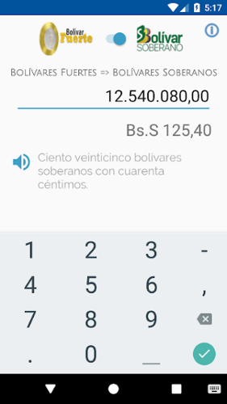
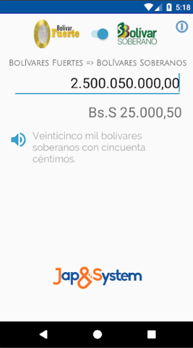
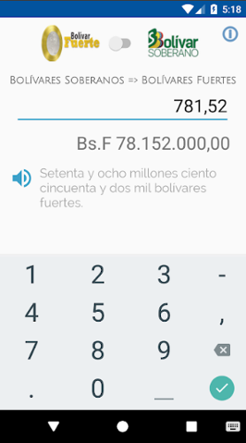

# Bolivar Soberano - Converter App

Description
-----------

Simple app to convert monetary values between the Bolívar Fuerte and the Bolívar Soberano in Venezuela.

The Monetary Reconversion in Venezuela consists in the change of monetary scale and of everything that is expressed in Venezuelan bolívars (https://en.wikipedia.org/wiki/Venezuelan_bol%C3%ADvar), with the elimination of five zeros, economic and commercial transactions will be facilitated.

The Monetary Reconversion becomes effective as of August 20, 2018 with a new monetary denomination called Sovereign Bolivar.

 

 
Features
-------------

* Convert from bolivares fuertes to sovereign bolivars and from sovereign bolivars to bolivares fuertes. 
* Shows the result expressed in numbers and in text.
* The rounding of the decimal figures is calculated according to the provisions of Resolution No. 18-07-02 issued by the Banco Central de Venezuela.
* The maximum amount to convert is 9 trillion both in numeric digits and in text.
* Option to listen to the result in audio through Text-To-Speech speech synthesis.

Compatibility
-------------

This app is compatible from API 18 (Android 4.3).

# Download from Google Play

The application can be downloaded from Google Play using 
the following URL

https://play.google.com/store/apps/details?id=com.japsystem.bolivarsoberano

 

